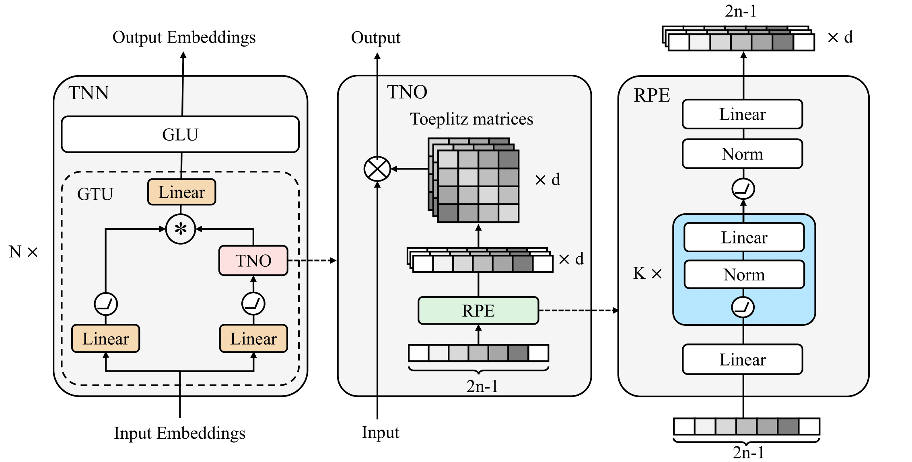

# TNN

Official implementation of Toeplitz Neural Network in our ICLR 2023 paper - [Toeplitz Neural Network for Sequence Modeling](https://openreview.net/forum?id=IxmWsm4xrua). This repo does not contain specific codes, but only scripts and some instructions on how to reproduce the results of the paper. The overall directory is as follows:


- [TNN](#tnn)
  - [Network Architecture](#network-architecture)
  - [Experiments](#experiments)
    - [Environments Preparation](#environments-preparation)
      - [Env1](#env1)
      - [Env2](#env2)
    - [Autoregressive language model](#autoregressive-language-model)
      - [1) Preprocess the data](#1-preprocess-the-data)
      - [2) Train the autoregressive language model](#2-train-the-autoregressive-language-model)
      - [3) Length extrapolation](#3-length-extrapolation)
    - [Bidirectional language model](#bidirectional-language-model)
      - [1) Preprocess the data](#1-preprocess-the-data-1)
      - [2) Train the bidirectional language model](#2-train-the-bidirectional-language-model)
      - [3) Finetuning](#3-finetuning)
    - [Image modeling](#image-modeling)
      - [1) Preparation](#1-preparation)
      - [2) Training](#2-training)
    - [LRA](#lra)
      - [1) Preparation](#1-preparation-1)
      - [2) Training](#2-training-1)
    - [Speed test](#speed-test)
  - [Standalone code](#standalone-code)
  - [Citation](#citation)
  - [Wip](#wip)


## Network Architecture

The overall network architecture is as follows:




## Experiments

### Environments Preparation

Our experiment uses two conda environments, where Autoregressive language modeling, Bidirectional language modeling, and Image modeling need to configure the environment according to the Env1 part, and LRA needs to configure the environment according to the Env2 part.

#### Env1

First, build the conda environment based on the yaml file:

```
conda env create --file env1.yaml
```

If you meet an error when installing torch, just remove torch and torchvision in the yaml file, rerun the above command, and then run the below commands:

```
pip install torch==1.8.1+cu111 torchvision==0.9.1+cu111 -f https://download.pytorch.org/whl/torch_stable.html
pip install -r requirements_tnn.txt
```

Finally, install our version of fairseq:

```
git clone https://github.com/OpenNLPLab/fairseq-evo.git
cd fairseq
pip install --editable ./
```


#### Env2

Build the conda environment based on the yaml file:

```
conda env create --file env2.yaml
```
If you encounter difficulties in setting up the environment, you can install the conda environment first, and then use the following command to install the pip packages:
```
pip install torch==1.10.0+cu111 torchvision==0.11.1+cu111 -f https://download.pytorch.org/whl/torch_stable.html
pip install -r requirements_lra.txt
```


### Autoregressive language model

#### 1) Preprocess the data

First download the [WikiText-103 dataset](https://www.salesforce.com/products/einstein/ai-research/the-wikitext-dependency-language-modeling-dataset/):

```
wget https://s3.amazonaws.com/research.metamind.io/wikitext/wikitext-103-raw-v1.zip
unzip wikitext-103-raw-v1.zip
```

Next, encode it with the GPT-2 BPE:

```
mkdir -p gpt2_bpe
wget -O gpt2_bpe/encoder.json https://dl.fbaipublicfiles.com/fairseq/gpt2_bpe/encoder.json
wget -O gpt2_bpe/vocab.bpe https://dl.fbaipublicfiles.com/fairseq/gpt2_bpe/vocab.bpe
for SPLIT in train valid test; do \
    python -m examples.roberta.multiprocessing_bpe_encoder \
        --encoder-json gpt2_bpe/encoder.json \
        --vocab-bpe gpt2_bpe/vocab.bpe \
        --inputs wikitext-103-raw/wiki.${SPLIT}.raw \
        --outputs wikitext-103-raw/wiki.${SPLIT}.bpe \
        --keep-empty \
        --workers 60; \
done
```

Finally, preprocess/binarize the data using the GPT-2 fairseq dictionary:

```
wget -O gpt2_bpe/dict.txt https://dl.fbaipublicfiles.com/fairseq/gpt2_bpe/dict.txt
fairseq-preprocess \
    --only-source \
    --srcdict gpt2_bpe/dict.txt \
    --trainpref wikitext-103-raw/wiki.train.bpe \
    --validpref wikitext-103-raw/wiki.valid.bpe \
    --testpref wikitext-103-raw/wiki.test.bpe \
    --destdir data-bin/wikitext-103 \
    --workers 60
```

This step comes from [fairseq](https://github.com/facebookresearch/fairseq/blob/main/examples/roberta/README.pretraining.md).


#### 2) Train the autoregressive language model

Use the following command to train the autoregressive language model:

```
bash script_alm.sh
```

You should change data_dir to preprocessed data.


#### 3) Length extrapolation

After training, you can do a length extrapolation test by the following command, where length is the test length, e.g. 512, 1024,....:

```
bash length_extrapolation.sh tnn_v2_decay_99_pre length
```


### Bidirectional language model

#### 1) Preprocess the data

The same as the autoregressive language model part.


#### 2) Train the bidirectional language model

Use the following command to train the bidirectional language model:

```
bash script_blm.sh
```

You should change data_dir to preprocessed data.


#### 3) Finetuning

Please refer to the [official Fairseq script](https://github.com/facebookresearch/fairseq/blob/main/examples/roberta/README.glue.md).


### Image modeling

#### 1) Preparation

Download the codebase:

```
git clone https://github.com/OpenNLPLab/im.git
```


#### 2) Training

Use the following command for training:

```
bash script_im.sh
```


### LRA

#### 1) Preparation

Download the codebase:

```
git clone https://github.com/OpenNLPLab/lra.gits
```

Download the data:

```
wget https://storage.googleapis.com/long-range-arena/lra_release.gz
mv lra_release.gz lra_release.tar.gz 
tar -xvf lra_release.tar.gz
```


#### 2) Training

Use the following script to run the experiments, you should change `PREFIX` to your lra path, and change `tasks` to a specific task, for aan, imdb and listops, the `archs` should be `tno`, for other tasks, the `archs` should be `tno2d`:

```
python script_lra.py
```

### Speed test

For Figure 1, we used the imdb task from lra benchmark for testing, and the config is tno-lra-imdb.yaml, and other models can adjust the model size according to this configuration. (we are cleaning up the code)

## Standalone code

For those of you who want to use tnn in your projects, you can install tnn-pytorch:

```
$ pip install tnn-pytorch
```

The code base is at the following address, you can adapt it as needed:

- [https://github.com/Doraemonzzz/tnn-pytorch](https://github.com/Doraemonzzz/tnn-pytorch)


## Citation

```
@inproceedings{
qin2023toeplitz,
title={Toeplitz Neural Network for Sequence Modeling},
author={Zhen Qin and Xiaodong Han and Weixuan Sun and Bowen He and Dong Li and Dongxu Li and Yuchao Dai and Lingpeng Kong and Yiran Zhong},
booktitle={The Eleventh International Conference on Learning Representations },
year={2023},
url={https://openreview.net/forum?id=IxmWsm4xrua}
}
```


## Wip

- [ ] Check the training script.
- [ ] Update tnn-pytorch.


